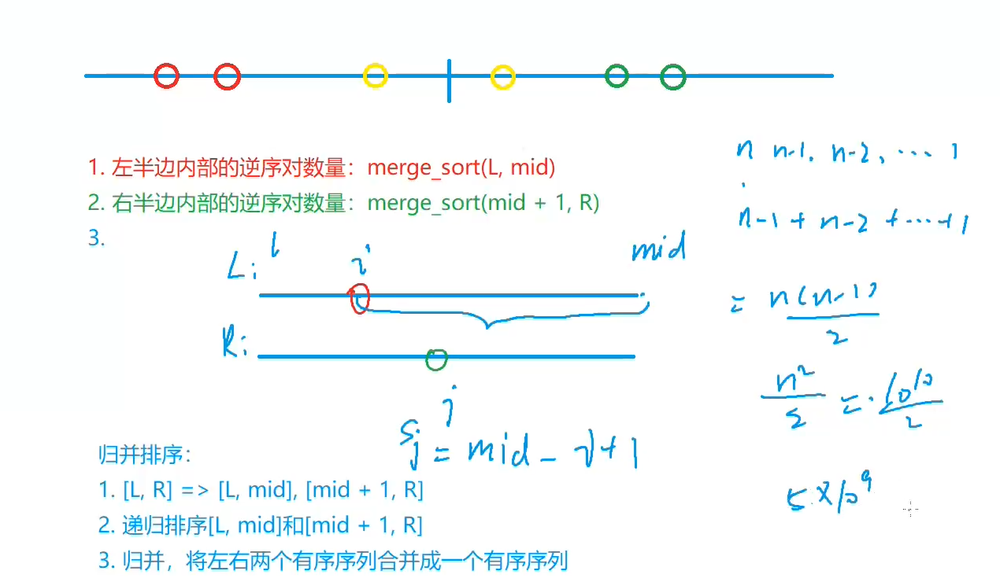

# AcWing 算法基础课 -- 基础算法

## AcWing 788. 逆序对的数量 

`难度：简单`

### 题目描述

给定一个长度为n的整数数列，请你计算数列中的逆序对的数量。

逆序对的定义如下：对于数列的第 i 个和第 j 个元素，如果满足 i < j 且 a[i] > a[j]，则其为一个逆序对；否则不是。

**输入格式**

第一行包含整数n，表示数列的长度。

第二行包含 n 个整数，表示整个数列。

**输出格式**

输出一个整数，表示逆序对的个数。

**数据范围**

$1≤n≤100000$

```r
输入样例：

6
2 3 4 5 6 1

输出样例：

5
```

### Solution

1. 分析左右两半部分，如果左半部分 q[i] 大于右半部分的 q[j]，那么从 i 到 mid 都可以和 j 组成逆序对，逆序对个数 res += mid - i + 1（左侧比当前数大的）

```java
#include <bits/stdc++.h>
using namespace std;

const int maxn = 1e5+5;
int a[maxn];
int temp[maxn];
int cnt;

void mergesort(int arr[], int l, int r){
    if(l>=r) return;
    int mid = l+r>>1;
    mergesort(arr,l,mid);
    mergesort(arr,mid+1,r);
    int k=0;
    int i=l;
    int j=mid+1;
    while(i<=mid&&j<=r){
        if(arr[i]<=arr[j])
            temp[k++] = arr[i++];
        else
            cnt+=mid-i+1;
    }
    while(i<=mid)
        temp[k++] = arr[i++];
    while(j<=r)
        temp[k++] = arr[j++];
    for (int i=l,j=0;i<=r;i++,j++){
		arr[i] = temp[j];
	}
}

int main(){
    int n;
    cin>>n;
    for(int i=0;i<n;i++)
        cin>>a[i];
    mergesort(a,0,n-1);
    cout<<cnt;
    return 0;
}
```

### yxc



逆序数指的是一个数列中逆序对的个数。

则我们只需要从左往右遍历，寻找左侧比当前元素大的元素个数，叠加即可。

或者直接找最右元素，左边所有比右边大的数即为逆序对个数。

而左侧比当前元素大的元素个数=左侧元素个数-左侧小于等于当前元素的元素个数。