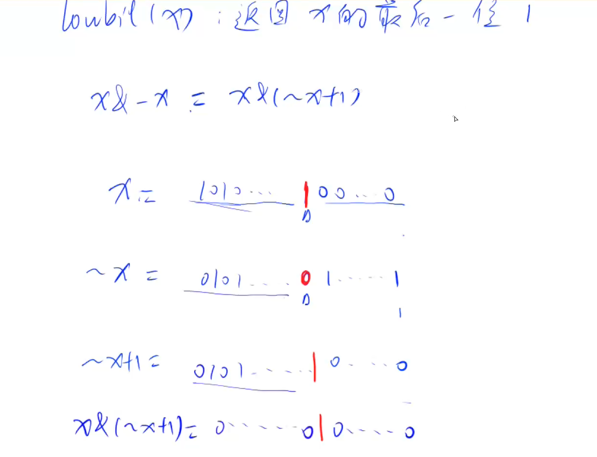
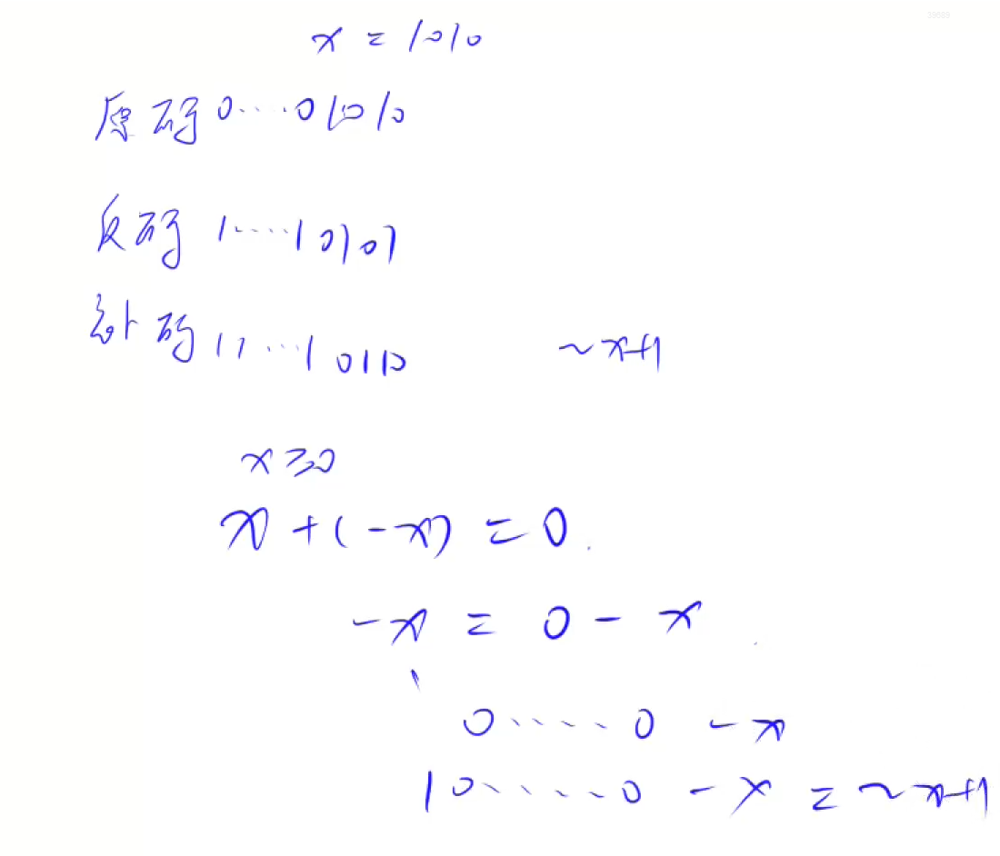

# AcWing 算法基础课 -- 基础算法

## AcWing 801. 二进制中1的个数 

`难度：简单`

### 题目描述

给定一个长度为n的数列，请你求出数列中每个数的二进制表示中1的个数。

**输入格式**

第一行包含整数n。

第二行包含n个整数，表示整个数列。

**输出格式**

共一行，包含n个整数，其中的第 i 个数表示数列中的第 i 个数的二进制表示中1的个数。

```r
数据范围

1≤n≤100000,
0≤数列中元素的值≤109

输入样例：

5
1 2 3 4 5

输出样例：

1 1 2 1 2
```

### Solution

1. 求 n 的第 k 为数字： `n >> k & 1`
2. 返回 x 的最后一位 1：lowbit(x)原理：`x & -x`;x & -x 其实就是 x & (~x + 1)`
3. 补码为什么是 `~x + 1`
```r
x + (-x) = 0
-x = 0 - x
-x =  000...000 - x
-x = 1000...000 - x
-x = ~x + 1
```

```c++
#include<bits/stdc++.h>
using namespace std;

const int maxn = 1e6+6;
int a[maxn];
int n;

int main(){
    cin>>n;
    for(int i=0;i<n;i++)
        cin>>a[i];

    for(int i=0;i<n;i++){
        int num = a[i];
        int cnt = 0;
        while(num>0){
            num&=num-1;
            cnt++;
        }
        cout<<cnt<<" ";
    }
    return 0;
}
```

### yxc

1. lowbit操作



2. 原码反码补码

