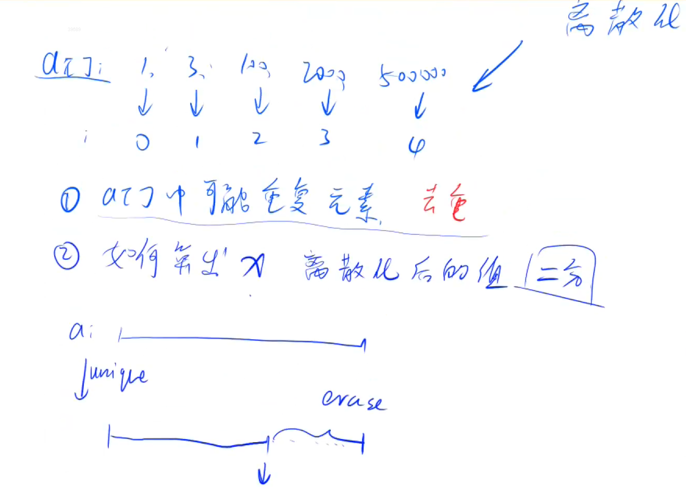

# AcWing 算法基础课 -- 基础算法

## AcWing 802. 区间和 

`难度：简单`

### 题目描述

假定有一个无限长的数轴，数轴上每个坐标上的数都是0。

现在，我们首先进行 n 次操作，每次操作将某一位置x上的数加c。

接下来，进行 m 次询问，每个询问包含两个整数l和r，你需要求出在区间[l, r]之间的所有数的和。

**输入格式**

第一行包含两个整数n和m。

接下来 n 行，每行包含两个整数x和c。

再接下里 m 行，每行包含两个整数l和r。

**输出格式**

共m行，每行输出一个询问中所求的区间内数字和。

数据范围

$ −10^9≤x≤10^9,$
$ 1≤n,m≤10^5,$
$ −10^9≤l≤r≤10^9,$
$ −10000≤c≤10000$
```r
输入样例：

3 3
1 2
3 6
7 5
1 3
4 6
7 8

输出样例：

8
0
5
```

### Solution

1. 用题目中会用到的数字最多有 3 * 10^5，可以用来离散化表示 10^9

```java
#include<bits/stdc++.h>
using namespace std;
typedef pair<int,int> pii;
vector<pii> p;
vector<pii> query;
vector<int> alls;

// 查找第一个等于x的元素
int find(int x){
    int l=0,r=alls.size()-1;
    while(l<r){
        int mid=(l+r)>>1;
        if(alls[mid]>=x) r=mid;
        else l=mid+1;
    }
    return l;
}

int a[300005],sum[300005],n,m;
int main(){
    scanf("%d%d",&n,&m);
    for(int i=1;i<=n;i++){
        int x,c;
        cin>>x>>c;
        alls.push_back(x);
        p.push_back({x,c});
    }
    for(int i=1;i<=m;i++){
        int l,r;
        cin>>l>>r;
        alls.push_back(l);
        alls.push_back(r);
        query.push_back({l,r});
    }
    sort(alls.begin(),alls.end());
    alls.erase(unique(alls.begin(),alls.end()),alls.end());
    for(auto item:p){
        a[find(item.first)]+=item.second;
    }
    for(int i=1;i<=alls.size();i++) sum[i]=sum[i-1]+a[i];
    for(auto item:query){
        int l=find(item.first),r=find(item.second);
        cout<<sum[r]-sum[l-1]<<endl;
    }
    return 0;
}
```


### yxc

1. 离散化



