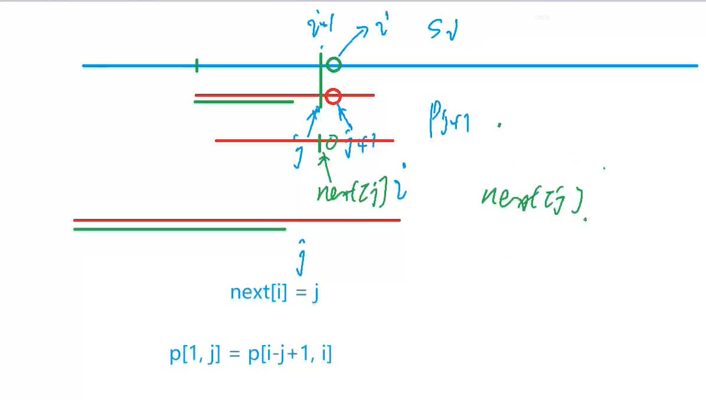
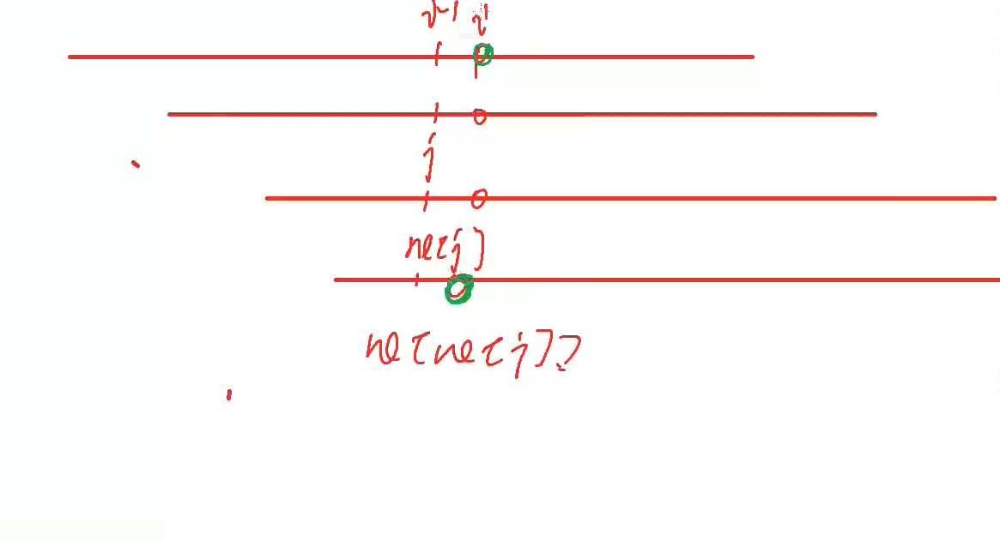

# AcWing 算法基础课 -- 数据结构

## AcWing 831. KMP字符串

`难度：简单`

### 题目描述

给定一个模式串S，以及一个模板串P，所有字符串中只包含大小写英文字母以及阿拉伯数字。

模板串P在模式串S中多次作为子串出现。

求出模板串P在模式串S中所有出现的位置的起始下标。

**输入格式**

第一行输入整数N，表示字符串P的长度。

第二行输入字符串P。

第三行输入整数M，表示字符串S的长度。

第四行输入字符串S。

**输出格式**

共一行，输出所有出现位置的起始下标（下标从0开始计数），整数之间用空格隔开。

**数据范围**

$1≤N≤10^5$

$1≤M≤10^6$


**输入样例：**

```R
3
aba
5
ababa
```

**输出样例：**

```R
0 2
```

### Solution

1. 暴力算法怎么做

```c++
#include <bits/stdc++.h>
using namespace std;
const int N = 1e5 + 10;

int pmt[N], ne[N];
string t, p;
vector<int> ans;


int main() {
    int N, M;
    cin >> N >> p >> M >> t;
    int i = 0, j = 0;
    while (i < t.length()) {
        if (t[i] == p[j]) {
            i++;
            j++;
        }
        else {
            j = 0;
            i = i - j + 1;
        }
        if (j == p.length()) {
            ans.push_back(i - p.length());
            i = i - j + 1;
            j = 0;
        }
    }
    if (ans.size() == 0)
        cout << -1;
    else {
        for (int num : ans)
            cout << num << " ";
    }
    return 0;
}
```

2. KMP 优化

```java
#include <bits/stdc++.h>
using namespace std;
const int N = 1e5 + 10;

int pmt[N], next[N];
string t, p;
vector<int> ans;

void getpmt(string p) {
    pmt[0] = 0;
    for (int i = 1, j = 0; i < p.length(); ++i) {
        while (j && p[i] != p[j])
            j = pmt[j - 1];
        if (p[i] == p[j])
            j++;
        pmt[i] = j;
    }
}

void kmp(string t, string p) {
    for (int i = 0, j = 0; i < t.length(); ++i) {
        while (j && t[i] != p[j])
            j = pmt[j - 1]; // 不断前移j指针，直到成功匹配或移到头为止
        if (t[i] == p[j])
            j++; // 当前位匹配成功，j指针右移
        if (j == p.length()) {
            j = pmt[j - 1];   // 继续匹配可能出现的第二个
            ans.push_back(i - p.length() + 1); // 返回子串在原串出现的第一个位置
        }
    }
}

int main() {
    int N, M;
    cin >> N >> p >> M >> t;
    getpmt(p);
    kmp(t, p);
    if (ans.size()==0)
        cout << -1;
    else {
        for (int num : ans)
            cout << num << " ";
    }
    return 0;
}
```

### yxc

1. KMP 匹配过程



2. 求 next 数组


