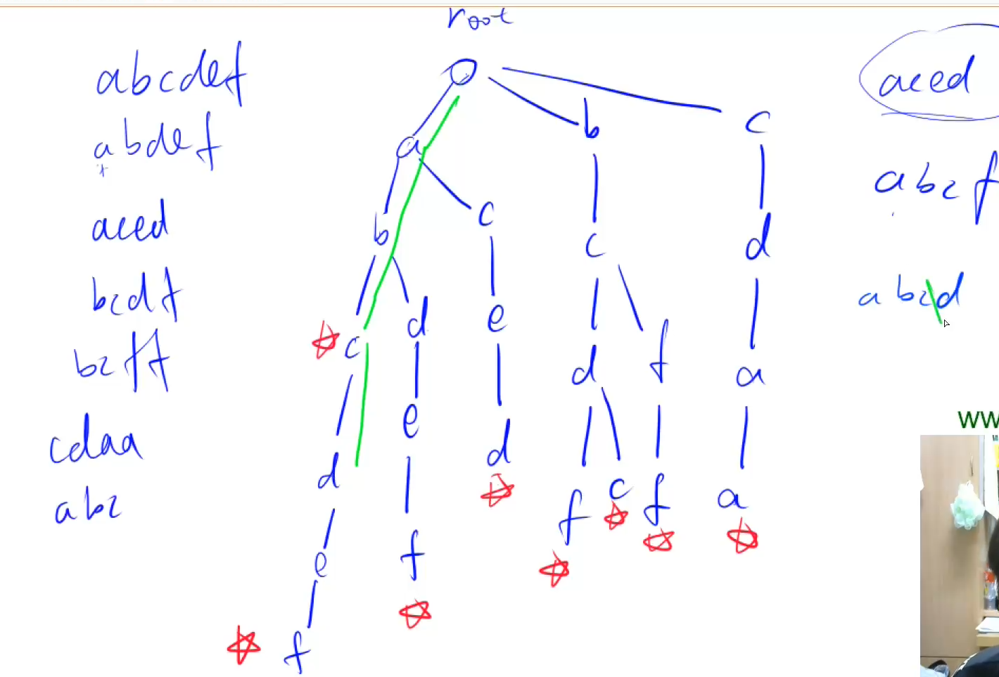

# AcWing 算法基础课 -- 数据结构

## AcWing 835. Trie字符串统计 

`难度：简单`

### 题目描述

维护一个字符串集合，支持两种操作：

1. “I x”向集合中插入一个字符串x；
2. “Q x”询问一个字符串在集合中出现了多少次。

共有N个操作，输入的字符串总长度不超过 $10^5$，字符串仅包含小写英文字母。

**输入格式**

第一行包含整数N，表示操作数。

接下来N行，每行包含一个操作指令，指令为”I x”或”Q x”中的一种。

**输出格式**

对于每个询问指令”Q x”，都要输出一个整数作为结果，表示x在集合中出现的次数。

每个结果占一行。

**数据范围**

$1 ≤ N ≤ 2 ∗ 10^4$

```r
输入样例：

5
I abc
Q abc
Q ab
I ab
Q ab

输出样例：

1
0
1

```

### Solution

1. 偷懒做法，用一个哈希表存储，做到时间复杂度为 O(n)。

```java
import java.util.*;
import java.io.*;

public class Main{
    public static void main(String[] args) throws IOException{
        BufferedReader br = new BufferedReader(new InputStreamReader(System.in));
        BufferedWriter bw = new BufferedWriter(new OutputStreamWriter(System.out));
        int n = Integer.parseInt(br.readLine());
        Map<String, Integer> map = new HashMap<>();
        String[] s;
        while(n > 0){
            n--;
            s = br.readLine().split(" ");
            if(s[0].equals("I")){
                map.put(s[1], map.getOrDefault(s[1], 0) + 1);
            }else{
                bw.write(map.getOrDefault(s[1], 0) + "\n");
            }
        }
        bw.close();
        br.close();
    }
}
```

2. 构造 Trie 树，Trie 树是**高效存储和查找字符串集合的数据结构**。

```c++
#include <bits/stdc++.h>
using namespace std;
const int N = 100010;
int son[N][26], cnt[N], idx;

void insert(string s) {
    int p = 1;
    for (int i = 0; i < s.size(); i++) {
        int u = s[i] - 'a';
        if (!son[p][u])
            son[p][u] = ++idx;
        p = son[p][u];
    }

    cnt[p]++;
}

int query(string s) {
    int p = 1;
    for (int i = 0; i < s.size(); i++) {
        int u = s[i] - 'a';
        if (!son[p][u])
            return 0;
        p = son[p][u];
    }

    return cnt[p];
}

int main() {
    int n;
    cin >> n;
    while (n--) {
        char op;
        string s;
        cin >> op;
        cin >> s;

        if (op == 'I')
            insert(s);
        else if (op == 'Q')
            cout << query(s) << endl;
    }
}
```

### yxc

