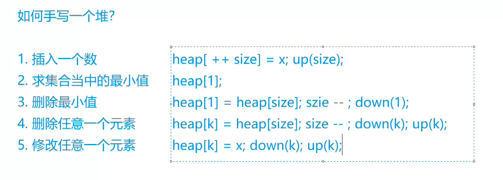
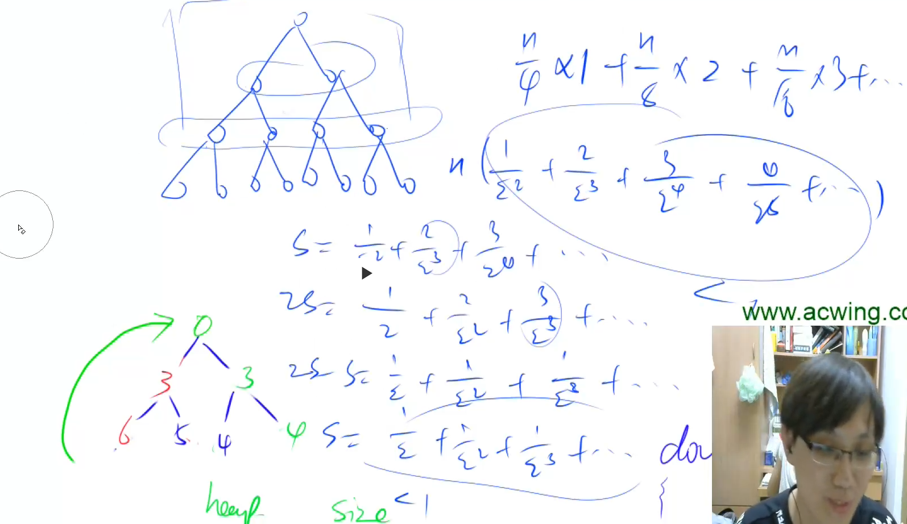

# AcWing 算法基础课 -- 数据结构

## AcWing 838. 堆排序

`难度：简单`

### 题目描述

输入一个长度为n的整数数列，从小到大输出前m小的数。

**输入格式**

第一行包含整数n和m。

第二行包含n个整数，表示整数数列。

**输出格式**

共一行，包含m个整数，表示整数数列中前m小的数。

**数据范围**

$1≤m≤n≤10^5$，
$1≤数列中元素≤10^9$

```r
5 3
4 5 1 3 2

输出样例：

1 2 3
```

### Solution

```c++
#include <bits/stdc++.h>
using namespace std;
const int N = 100010;
int h[N], sz;
// root=1
// 小根堆


void up(int x) {
    while (x > 1 && h[x] < h[x / 2]) {
        swap(h[x], h[x / 2]);
        x /= 2;
    }
}

void down(int x) {
    int t = x;
    if (2 * x <= sz && h[t] > h[2 * x])
        t = 2 * x;
    if (2 * x + 1 <= sz && h[t] > h[2 * x + 1])
        t = 2 * x + 1;
    if (t != x) {
        swap(h[t], h[x]);
        down(t);
    }
}

// O(n)
void buildheap() {
    for (int i = sz / 2; i >= 1; i--) {
        down(i);
    }
}

int main() {
    int n,m;
    cin >> n >> m;
    sz = n;
    for(int i=1;i<=n;i++) {
        cin>>h[i];
    }
    buildheap();
    for(int i=1;i<=m;i++){
        cout<<h[1]<<" ";
        swap(h[1], h[sz]);
        sz--;
        down(1);
    }
    return 0;
}
```

### yxc

下标从 1 开始比较好，从 0 开始的画， `2 * 0` 还是 0



从 `1 ~ n/2`开始建堆，时间复杂度为 `O(n)`，证明如下


