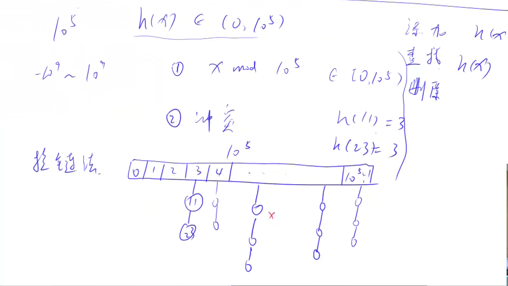

# AcWing 算法基础课 -- 数据结构

## AcWing 840. 模拟散列表 

`难度：简单`

### 题目描述

维护一个集合，支持如下几种操作：

- “I x”，插入一个数x；
- “Q x”，询问数x是否在集合中出现过；

现在要进行N次操作，对于每个询问操作输出对应的结果。

**输入格式**

第一行包含整数N，表示操作数量。

接下来N行，每行包含一个操作指令，操作指令为”I x”，”Q x”中的一种。

**输出格式**

对于每个询问指令“Q x”，输出一个询问结果，如果x在集合中出现过，则输出“Yes”，否则输出“No”。

每个结果占一行。

**数据范围**

$1≤N≤10^5$

$−10^9≤x≤10^9$

```r
输入样例：

5
I 1
I 2
I 3
Q 2
Q 5

输出样例：

Yes
No
```

### Solution

模拟散列表要注意两点：1. 哈希算法：x mod $10^5$(取模的值尽量取成质数，开放寻址法要取 2~3 倍的空间)；2. 解决冲突，开放寻址法或者拉链法。

1. 拉链法

```java
#include <bits/stdc++.h>
using namespace std;
const int mod = 1e5 + 7;
const int N = mod + 10;

vector<int> h[N];

bool find(int x) {
    int k = (x % mod + mod) % mod;
    for (int i = 0; i < h[k].size(); i++) {
        if (h[k][i] == x)
            return true;
    }
    return false;
}

void insert(int x) {
    int k = (x % mod + mod) % mod;
    h[k].push_back(x);
}

int main() {
    int n;
    cin >> n;
    char op;
    int x;
    for (int i = 0; i < n; i++) {
        cin >> op >> x;
        if (op == 'I') {
            insert(x);
        }
        else if (op == 'Q') {
            if (find(x))
                cout << "Yes" << endl;
            else
                cout << "No" << endl;
        }
    }
    return 0;
}
```

2. 开放寻址法

```c++
#include <bits/stdc++.h>
using namespace std;
const int mod = 1e5 + 7;
const int N = mod + 10;
const int flag = 0x7fffffff;

int h[N];
int cnt;

// 为h初始化val不存在的值，表示这个位置还没有插入
void init() {
    for (int i = 0; i < N; i++) {
        h[i] = flag;
    }
}

// 返回下标
bool find_idx(int x) {
    int p=0;
    int k = (x % mod + mod) % mod;
    while (h[k] != x) {
        k++;
        p++;
        if (k == N)
            k = 0;
        if(p>=N)
            return -1;
    }
    return k;
}

bool find(int x) {
    int p=0;
    int k = (x % mod + mod) % mod;
    while (h[k] != x) {
        k++;
        p++;
        if (k == N)
            k = 0;
        if(p>=N)
            return false;
    }
    return true;
}

void insert(int x) {
    if (cnt == N)
        return;
    int k = (x % mod + mod) % mod;
    while (h[k] != flag) {
        k++;
        if (k == N)
            k = 0;
    }
    h[k] = x;
    cnt++;
}

int main() {
    int n;
    cin >> n;
    char op;
    int x;
    init();
    for (int i = 0; i < n; i++) {
        cin >> op >> x;
        if (op == 'I') {
            insert(x);
        }
        else if (op == 'Q') {
            if (find(x))
                cout << "Yes" << endl;
            else
                cout << "No" << endl;
        }
    }
    return 0;
}
```

### yxc

