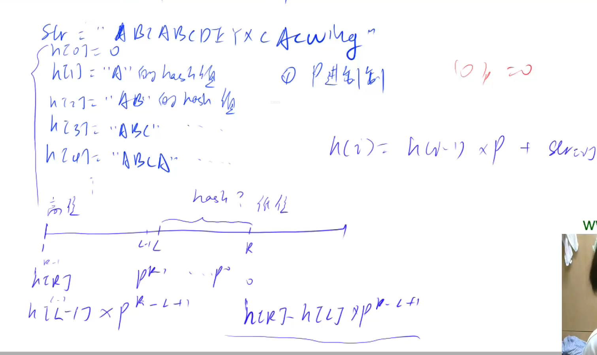

# AcWing 算法基础课 -- 数据结构

## AcWing 841. 字符串哈希 

`难度：简单`

### 题目描述

给定一个长度为n的字符串，再给定m个询问，每个询问包含四个整数l1,r1,l2,r2，请你判断[l1,r1]和[l2,r2

]这两个区间所包含的字符串子串是否完全相同。

字符串中只包含大小写英文字母和数字。

**输入格式**

第一行包含整数n和m，表示字符串长度和询问次数。

第二行包含一个长度为n的字符串，字符串中只包含大小写英文字母和数字。

接下来m行，每行包含四个整数l1,r1,l2,r2，表示一次询问所涉及的两个区间。

注意，字符串的位置从1开始编号。

**输出格式**

对于每个询问输出一个结果，如果两个字符串子串完全相同则输出“Yes”，否则输出“No”。

每个结果占一行。

**数据范围**

$1≤n,m≤10^5$

```r
输入样例：

8 3
aabbaabb
1 3 5 7
1 3 6 8
1 2 1 2

输出样例：

Yes
No
Yes
```

### Solution

```c++
#include <bits/stdc++.h>
using namespace std;

typedef unsigned long long ull;

// p取131或13331,加上Q取余数取2^64，这样的话哈希表在99%情况下不会出现冲突
const int N = 100010, P = 131;

// h是哈希表，h[i]表示前i个字符的哈希值，p是位权
ull h[N], p[N];

// 区间和公式
ull query(int l, int r) { return h[r] - h[l - 1] * p[r - l + 1]; }

int main() {
    int n, m;
    cin >> n >> m;
    string s;
    cin >> s;
    h[0] = 0;
    p[0] = 1;
    // 遍历字符串
    for (int i = 0; i < n; i++) {
        p[i + 1] = p[i] * P;
        // 前缀和求哈希值，*p表示左移一位，加s[i]表示更新最低位，字符以ASCII形式存储，是数字
        h[i + 1] = h[i] * P + s[i];
    }
    while (m--) {
        int a, b, c, d;
        cin >> a >> b >> c >> d;
        if (query(a, b) == query(c, d))
            cout << "Yes" << endl;
        else
            cout << "No" << endl;
    }
    return 0;
}
```

### yxc




