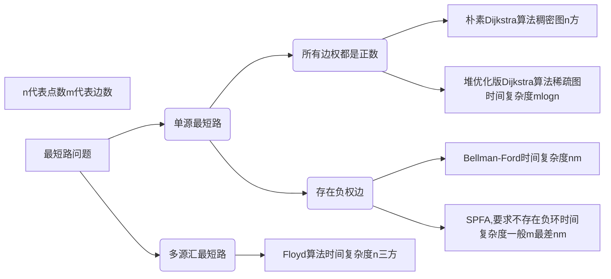
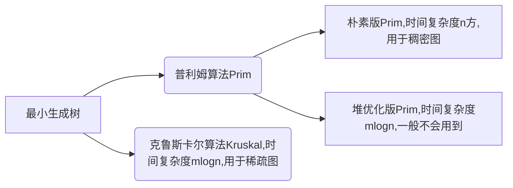
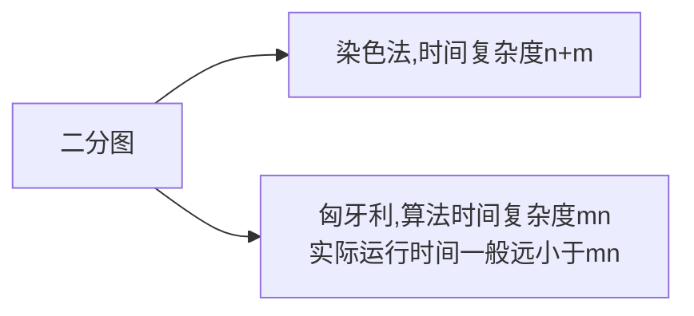
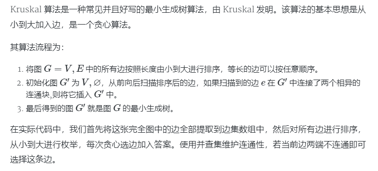

# AcWing 算法基础课 -- 搜索与图论

[TOC]

包括DFS，BFS，树与图的深度优先遍历，树与图的广度优先遍历，拓扑排序，Dijkstra，bellman-ford，spfa，Floyd，Prim，Kruskal，染色法判定二分图，匈牙利算法等内容。

## 题目

DFS
- [x] AcWing 842. 排列数字
- [x] AcWing 843. n-皇后问题

BFS
- [ ] AcWing 844. 走迷宫
- [ ] AcWing 845. 八数码

树与图的深度优先遍历
- [ ] AcWing 846. 树的重心

树与图的广度优先遍历
- [ ] AcWing 847. 图中点的层次

拓扑排序
- [ ] AcWing 848. 有向图的拓扑序列

Dijkstra
- [ ] AcWing 849. Dijkstra求最短路 I
- [ ] AcWing 850. Dijkstra求最短路 II

bellman-ford
- [ ] AcWing 853. 有边数限制的最短路

spfa
- [ ] AcWing 851. spfa求最短路
- [ ] AcWing 852. spfa判断负环

Floyd
- [ ] AcWing 854. Floyd求最短路

Prim
- [ ] AcWing 858. Prim算法求最小生成树

Kruskal
- [ ] AcWing 859. Kruskal算法求最小生成树

染色法判定二分图
- [ ] AcWing 860. 染色法判定二分图

匈牙利算法
- [ ] AcWing 861. 二分图的最大匹配

## 模板

参考 AcWing [https://www.acwing.com/blog/content/405/](https://www.acwing.com/blog/content/405/)

### 框架总结

1. DFS 与 BFS

||数据结构|空间|性质|
|---|---|---|---|
|DFS|stack|$O(h)$|不具有最短性|
|BFS|queue|$O(2^n)$|最短路|

2. 最短路问题

最短路问题分为单源最短路和多源汇最短路。考察的侧重点在于从背景抽象建图，不在于算法的证明。

**一般用SPFA算法**



3. 最小生成树

**最小生成树一般处理无向图**，稠密图用朴素版prim算法，稀疏图用kruskal算法，一般堆优化的prim用的不多。 

最小生成树的用途：城市之间铺设电缆，保证电缆总长度最短，这就是最小生成树最短。



4. 二分图

**二分图性质：当且仅当图中不含奇数环。**

二分图用法：关押罪犯

染色法是如何判别一个图是不是二分图，其实就是一个DFS，时间复杂度O(n+m)。

匈牙利算法求二分图的最大匹配，时间复杂度O(mn)，实际运行时间一般远小于mn。



### 树与图的存储

树是一种特殊的图，与图的存储方式相同。图分有向图和无向图，对于无向图中的边ab，存储两条有向边a->b, b->a。所以只需要考虑有向图就可以了。

有向图的存储：邻接矩阵`g[a][b] 存储边a->b`或者邻接表

```cpp
// 邻接表存储图
// 对于每个点k，开一个单链表，存储k所有可以走到的点。h[k]存储这个单链表的头结点
int h[N], e[N], ne[N], idx;

// 添加一条边a->b
void add(int a, int b)
{
    e[idx] = b, ne[idx] = h[a], h[a] = idx ++ ;
}

// 初始化
idx = 0;
memset(h, -1, sizeof h);
```

我的存法：

```
vector<int> edge[maxn];

void init(){
    for(int i=0;i<maxn;i++){
        edge[i].clear();
    }
}
```


### 树与图的遍历

时间复杂度 O(n+m), n 表示点数，m 表示边数

1. 深度优先遍历 —— 模板题 AcWing 846. 树的重心
```cpp
int dfs(int u)
{
    st[u] = true; // st[u] 表示点u已经被遍历过

    for (int i = h[u]; i != -1; i = ne[i])
    {
        int j = e[i];
        if (!st[j]) dfs(j);
    }
}
```
2. 宽度优先遍历 —— 模板题 AcWing 847. 图中点的层次
```cpp
queue<int> q;
st[1] = true; // 表示1号点已经被遍历过
q.push(1);

while (q.size())
{
    int t = q.front();
    q.pop();

    for (int i = h[t]; i != -1; i = ne[i])
    {
        int j = e[i];
        if (!st[j])
        {
            st[j] = true; // 表示点j已经被遍历过
            q.push(j);
        }
    }
}
```

我的模板

bfs：

```cpp
#include <bits/stdc++.h>  
using namespace std;  
  
const int maxn = 100 + 5;  
char mpt[maxn][maxn];  
int vis[maxn][maxn];  
int dir[4][2] = {0, 1, 1, 0, 0, -1, -1, 0};  
struct node {  
    int x, y;  
    int step;  
};  
//使用广度优先搜索求解  
int bfs(int sx, int sy) {  
    memset(vis, 0, sizeof(vis));  
    queue<node> q;//使用队列来维护一层层发散的优先级  
    q.push(node{sx, sy, 0});  
    vis[sx][sy] = 1;  
    int ans = -1;  
    while(!q.empty()) {  
        node now = q.front();  
        q.pop();  
        if (mpt[now.x][now.y] == 'E') {//找到终点  
            ans = now.step;  
            break;  
        }  
        for (int i = 0; i < 4; i++) {//上下左右四个方向  
            int nx = now.x + dir[i][0];  
            int ny = now.y + dir[i][1];  
            if ((mpt[nx][ny] == '*' || mpt[nx][ny] == 'E')&&vis[nx][ny] 
                q.push(node{nx, ny, now.step + 1});  
                vis[nx][ny] = 1;  
            }  
        }  
    }  
    return ans;  
}  
int main() {  
    int h, w;  
    while (scanf("%d%d", &h, &w) != EOF) {  
        if (h == 0 && w == 0) break;  
        int sx = 0, sy = 0;  
        memset(mpt, 0, sizeof(mpt));  
        for (int i = 1; i <= h; i++) {  
            scanf("%s", mpt[i] + 1);  
            for (int j = 1; j <= w; j++) {  
                if (mpt[i][j] == 'S') {  
                    sx = i, sy = j;//记录起点坐标  
                }  
            }  
        }  
        int ans = bfs(sx, sy);  
        printf("%d\n", ans);  
    }  
    return 0;  
}
```

dfs：

```cpp
#include <bits/stdc++.h>  
using namespace std;  
  
const int maxn = 100 + 5;  
char mpt[maxn][maxn];  
int vis[maxn][maxn];  
int dir[8][2] = {1,0,0,-1,-1,0,0,1,1,1,1,-1,-1,1,-1,-1};  
//使用深度优先搜索求解  
int dfs(int x, int y) {  
    vis[x][y] = 1;  
    for (int i = 0; i < 8; i++) {//8个方向  
        int nx = x + dir[i][0];  
        int ny = y + dir[i][1];  
        if (mpt[nx][ny] == '@' && vis[nx][ny] == 0) {  
            dfs(nx, ny);  
        }  
    }  
}  
int main() {  
    int h, w;  
    while (scanf("%d%d", &h, &w) != EOF) {  
        if (h == 0 && w == 0) break;  
        int sx = 0, sy = 0;  
        memset(mpt, 0, sizeof(mpt));  
        memset(vis, 0, sizeof(vis));  
        for (int i = 1; i <= h; i++) {  
            scanf("%s", mpt[i] + 1);  
        }  
        int ans = 0;  
        for (int i = 1; i <= h; i++) {  
            for (int j = 1; j <= w; j++) {  
                if (vis[i][j] == 0 && mpt[i][j] == '@') {  
                    ans++;  
                    dfs(i, j);  
                }  
            }  
        }  
        printf("%d\n", ans);  
    }  
    return 0;  
}
```

### 回溯问题

回溯问题是dfs中的一大类题型，主要包括组合，排列，子集，分割问题。注意进行区分。

- 组合问题：N个数里面按一定规则找出k个数的集合
- 排列问题：N个数按一定规则全排列，有几种排列方式
- 子集问题：一个N个数的集合里有多少符合条件的子集
- 切割问题：一个字符串按一定规则有几种切割方式
- 棋盘问题：N皇后，解数独等等

```cpp
void backtracking(参数) {
    if (终止条件) {
        存放结果;
        return;
    }

    for (选择：本层集合中元素（树中节点孩子的数量就是集合的大小）) {
        处理节点;
        // if(!isvalid()) continue;    // 一般判断是否合法的条件写在这
        backtracking(路径，选择列表); // 递归
        回溯，撤销处理结果
    }
}

排列一般不用start_index来显式确定本层集合中元素
而组合一般需要用start_index来显式确定本层集合中元素
```


### 拓扑排序 —— 模板题 AcWing 848. 有向图的拓扑序列

时间复杂度 O(n+m), n 表示点数，m 表示边数

**有向图才会有拓扑序列**，若一个由图中所有点构成的序列A满足：对于图中的每条边(x, y)，x在A中都出现在y之前，则称A是该图的一个拓扑序列。

```cpp
bool topsort()
{
    int hh = 0, tt = -1;

    // d[i] 存储点i的入度
    for (int i = 1; i <= n; i ++ )
        if (!d[i])
            q[ ++ tt] = i;

    while (hh <= tt)
    {
        int t = q[hh ++ ];

        for (int i = h[t]; i != -1; i = ne[i])
        {
            int j = e[i];
            if (-- d[j] == 0)
                q[ ++ tt] = j;
        }
    }

    // 如果所有点都入队了，说明存在拓扑序列；否则不存在拓扑序列。
    return tt == n - 1;
}
```

我的模板

```
在一个有向图中，对所有的节点进行排序，要求没有一个节点指向它前面的节点。

先统计所有节点的入度，对于入度为0的节点就可以分离出来，然后把这个节点指向的节点的入度减一。

一直做改操作，直到所有的节点都被分离出来。

如果最后存在入度为不0的节点，那就说明有环，不存在拓扑排序，也就是很多题目的无解的情况。
或者记录入队数是否等于总节点数

https://www.noobdream.com/DreamJudge/Issue/page/1566/
#include<iostream>
#include<string>
#include<algorithm>
#include<vector>
#include<cstring>
#include<queue>

using namespace std;

const int maxn = 5e2+5;

bool graph[maxn][maxn];
int degree[maxn];
int path[maxn];
vector<int> edge[maxn];

void init(){
    for(int i=0;i<maxn;i++){
        edge[i].clear();
    }
    memset(graph,0,sizeof(graph));
    memset(degree,0,sizeof(degree));
    memset(path,0,sizeof(path));
}

bool topo(int n){
    //优先队列用来确认字典序  小顶堆
    priority_queue<int,vector<int>,greater<int> > pq;
    int cnt = 0;
    for(int i=1;i<=n;i++){
        if(!degree[i])
            pq.push(i);
    }
    while(!pq.empty()){
        int now = pq.top();
        path[cnt]=now;
        pq.pop();
        cnt++;
        for(int i=0;i<edge[now].size();i++){
            int next = edge[now][i];
            degree[next]--;
            if(!degree[next])
                pq.push(next);
        }
    }
    return cnt==n;
}

int main(){
    int n,m;
    while(cin>>n>>m){
        init();
        for(int i=0;i<m;i++){
            int u,v;
            cin>>u>>v;
            graph[u][v]=1;
        }
        for(int i=1;i<=n;i++){
            for(int j=1;j<=n;j++){
                if(graph[i][j]){
                    edge[i].push_back(j);
                    degree[j]++;
                }
            }
        }
        bool flag;
        flag = topo(n);
        for(int i=0;i<n-1;i++){
            cout<<path[i]<<" ";
        }
        cout<<path[n-1]<<endl;
    }
    return 0;
}
```

### 朴素dijkstra算法 —— 模板题 AcWing 849. Dijkstra求最短路 I

时间复杂是 $O(n^2+m)$, n 表示点数，m 表示边数

1. 思路
```r
初始化 dist[1] = 0, dist[i] = 正无穷
for n 次
    for 遍历每一个点
        找到未处理的距离起点的最小值 t
	用 t 更新所有 dist[i]
```

2. 模板
```cpp
int g[N][N];  // 存储每条边
int dist[N];  // 存储1号点到每个点的最短距离
bool st[N];   // 存储每个点的最短路是否已经确定

// 求1号点到n号点的最短路，如果不存在则返回-1
int dijkstra()
{
    memset(dist, 0x3f, sizeof dist);
    dist[1] = 0;

    for (int i = 0; i < n; i ++ )
    {
        int t = -1;     // 在还未确定最短路的点中，寻找距离最小的点
        for (int j = 1; j <= n; j ++ )
            if (!st[j] && (t == -1 || dist[t] > dist[j]))
                t = j;

        // 用t更新其他点的距离
        for (int j = 1; j <= n; j ++ )
            dist[j] = min(dist[j], dist[t] + g[t][j]);

        st[t] = true;
    }

    if (dist[n] == 0x3f3f3f3f) return -1;
    return dist[n];
}
```

### 堆优化版dijkstra —— 模板题 AcWing 850. Dijkstra求最短路 II

时间复杂度 $O(mlogn)$, n 表示点数，m 表示边数

显然相较于普通的dijkstra，在找寻离当前节点最近的节点时可以使用堆的方式保存最小值，称为堆优化

```cpp
typedef pair<int, int> PII;

int n;      // 点的数量
int h[N], w[N], e[N], ne[N], idx;       // 邻接表存储所有边
int dist[N];        // 存储所有点到1号点的距离
bool st[N];     // 存储每个点的最短距离是否已确定

// 求1号点到n号点的最短距离，如果不存在，则返回-1
int dijkstra()
{
    memset(dist, 0x3f, sizeof dist);
    dist[1] = 0;
    priority_queue<PII, vector<PII>, greater<PII>> heap;
    heap.push({0, 1});      // first存储距离，second存储节点编号

    while (heap.size())
    {
        auto t = heap.top();
        heap.pop();

        int ver = t.second, distance = t.first;

        if (st[ver]) continue;
        st[ver] = true;

        for (int i = h[ver]; i != -1; i = ne[i])
        {
            int j = e[i];
            if (dist[j] > distance + w[i])
            {
                dist[j] = distance + w[i];
                heap.push({dist[j], j});
            }
        }
    }

    if (dist[n] == 0x3f3f3f3f) return -1;
    return dist[n];
}
```

我的模板

```cpp
// dijkstra + 堆优化  
#include <bits/stdc++.h>  
using namespace std;  
  
const int inf = 0x3f3f3f3f  ;
const int maxn = 105;  
int n, m;  
  
struct Edge{  
    int u, v, w;  
    Edge(int u, int v, int w):u(u),v(v),w(w) {}  
};  

// 构造小顶堆 方便寻找距离当前节点的最近距离节点
struct node {  
    int d, u;  
    node(int d, int u):d(d),u(u) {}  
    bool operator < (const node &a) {  
        return d > a.d;  
    }  
};  
  
vector<Edge> edges[maxn];  
int dist[maxn]; // 存放起点到i点的最短距离  
int vis[maxn]; // 标记是否访问过  
int p[maxn]; // 存放路径  
  
void init(){
    for(int i=0;i<=n;i++){
        edges[i].clear();
    }
    memset(dis,0x3f,sizeof(dis));
    memset(visit,0,sizeof(visit));
    memset(path,0,sizeof(path));
}

void dijkstra(int s) {  
    priority_queue<node> pq;  
    dist[s] = 0;  
    pq.push(node(0, s));  
    int cnt = 0; //统计松弛次数  
    while (!pq.empty()) {  
        node now = pq.top(); pq.pop();  
        int u = now.u;  
        if (vis[u]) continue;  
        vis[u] = 1;  
        cnt++;  
        if(cnt >= n) break; // 小优化  
        for (int i = 0; i < edges[u].size(); i++) { // // Sum -> O(E)  
            Edge& e = edges[u][i];  
            if (dist[e.v] > dist[u] + e.w) { // O(lgV)  
                dist[e.v] = dist[u] + e.w;  
                p[e.v] = u;  
                q.push(node(dist[e.v], e.v));  
            }  
        }  
    }  
}  
  
void addedge(int u, int v, int w) {  
    Edge temp(u,v,w);
	edges[u].push_back(temp);
}  
  

  
int main() {  
    while (scanf("%d%d", &n, &m) != EOF) {  
        if (n + m == 0) break;  
        init();  
        for (int i = 0; i < m; i++) {  
            int a, b, c;  
            scanf("%d%d%d", &a, &b, &c);  
            addedge(a, b, c);  
            addedge(b, a, c);  
        }  
        dijkstra(1);  
        printf("%d\n",dist[n]);  
    }  
    return 0;  
}  
```

### Bellman-Ford算法 —— 模板题 AcWing 853. 有边数限制的最短路

时间复杂度 $O(nm)$, n 表示点数，m 表示边数

注意在模板题中需要对下面的模板稍作修改，加上备份数组，详情见模板题。

**一般 spfa 性能比 Bellman-Ford 好，只有特殊情况下用 Bellman-Ford 算法**

1. 思路
```r
for n 次
    for 所有边 a,b,w
        dist[b] = min(dist[b], dist[a] + w)
```

2. 模板
```cpp
int n, m;       // n表示点数，m表示边数
int dist[N];        // dist[x]存储1到x的最短路距离

struct Edge     // 边，a表示出点，b表示入点，w表示边的权重
{
    int a, b, w;
}edges[M];

// 求1到n的最短路距离，如果无法从1走到n，则返回-1。
int bellman_ford()
{
    memset(dist, 0x3f, sizeof dist);
    dist[1] = 0;

    // 如果第n次迭代仍然会松弛三角不等式，就说明存在一条长度是n+1的最短路径，由抽屉原理，路径中至少存在两个相同的点，说明图中存在负权回路。
    for (int i = 0; i < n; i ++ )
    {
        for (int j = 0; j < m; j ++ )
        {
            int a = edges[j].a, b = edges[j].b, w = edges[j].w;
            if (dist[b] > dist[a] + w)
                dist[b] = dist[a] + w;
        }
    }

    if (dist[n] > 0x3f3f3f3f / 2) return -1;
    return dist[n];
}
```

### spfa 算法（队列优化的Bellman-Ford算法） —— 模板题 AcWing 851. spfa求最短路

时间复杂度 平均情况下 $O(m)$，最坏情况下 $O(nm)$, n 表示点数，m 表示边数

要求不存在负环，**一般 spfa 性能比 Bellman-Ford 好，只有特殊情况下用 Bellman-Ford 算法**。


1. 思路
```r
# spfa 就是 bellman-ford 算法加上宽搜优化
# dist[b] = min(dist[b], dist[a] + w) 可以发现只有 dist[a] 变小了，dist[b] 才会变小
q.add(1);
while(q不空)
    1. t = q.pop();
    2. 更新 t 的所有出边，把出边指向的顶点入队

```

2. 模板

```cpp
int n;      // 总点数
int h[N], w[N], e[N], ne[N], idx;       // 邻接表存储所有边
int dist[N];        // 存储每个点到1号点的最短距离
bool st[N];     // 存储每个点是否在队列中

// 求1号点到n号点的最短路距离，如果从1号点无法走到n号点则返回-1
int spfa()
{
    memset(dist, 0x3f, sizeof dist);
    dist[1] = 0;

    queue<int> q;
    q.push(1);
    st[1] = true;

    while (q.size())
    {
        auto t = q.front();
        q.pop();

        st[t] = false;

        for (int i = h[t]; i != -1; i = ne[i])
        {
            int j = e[i];
            if (dist[j] > dist[t] + w[i])
            {
                dist[j] = dist[t] + w[i];
                if (!st[j])     // 如果队列中已存在j，则不需要将j重复插入
                {
                    q.push(j);
                    st[j] = true;
                }
            }
        }
    }

    if (dist[n] == 0x3f3f3f3f) return -1;
    return dist[n];
}
```

### spfa判断图中是否存在负环 —— 模板题 AcWing 852. spfa判断负环

时间复杂度是 $O(nm)$, n 表示点数，m 表示边数

```cpp
int n;      // 总点数
int h[N], w[N], e[N], ne[N], idx;       // 邻接表存储所有边
int dist[N], cnt[N];        // dist[x]存储1号点到x的最短距离，cnt[x]存储1到x的最短路中经过的点数
bool st[N];     // 存储每个点是否在队列中

// 如果存在负环，则返回true，否则返回false。
bool spfa()
{
    // 不需要初始化dist数组
    // 原理：如果某条最短路径上有n个点（除了自己），那么加上自己之后一共有n+1个点，由抽屉原理一定有两个点相同，所以存在环。

    queue<int> q;
    for (int i = 1; i <= n; i ++ )
    {
        q.push(i);
        st[i] = true;
    }

    while (q.size())
    {
        auto t = q.front();
        q.pop();

        st[t] = false;

        for (int i = h[t]; i != -1; i = ne[i])
        {
            int j = e[i];
            if (dist[j] > dist[t] + w[i])
            {
                dist[j] = dist[t] + w[i];
                cnt[j] = cnt[t] + 1;
                if (cnt[j] >= n) return true;       // 如果从1号点到x的最短路中包含至少n个点（不包括自己），则说明存在环
                if (!st[j])
                {
                    q.push(j);
                    st[j] = true;
                }
            }
        }
    }

    return false;
}
```

我的模板

```
//spfa 一般用邻接链表
#include <iostream>
#include <string>
#include <algorithm>
#include <vector>
#include <cstring>
#include <queue>
#define inf 0x3f3f3f3f
using namespace std;

const int maxn = 1e2+2;

struct Edge{
    int next;
    int val;
    Edge(int next,int val):next(next),val(val){}
};
vector<Edge> edge[maxn];
bool visit[maxn];
int dis[maxn];
int path[maxn];
int cnt[maxn];    //用来判断是否出现负边环
int N,M;

void init(){
    for(int i=0;i<maxn;i++){
        edge[i].clear();
    }
    memset(visit,0,sizeof(visit));
    memset(dis,0x3f,sizeof(dis));
    memset(path,0,sizeof(path));
}

void addedge(int u,int v,int w){
    Edge temp(v,w);
    edge[u].push_back(temp);
}

void spfa(int s){
    queue<int> q;
    dis[s] = 0;
    q.push(s);
    while(!q.empty()){
        int now = q.front();
        q.pop();
        visit[now] = false;
        cnt[now]++;
        for(int i=0;i<edge[now].size();i++){
            Edge e = edge[now][i];
            if(dis[e.next]>dis[now]+e.val){
                dis[e.next]=dis[now]+e.val;
                path[e.next] = now;
                if(!visit[e.next]){
                    q.push(e.next);
                    visit[e.next] = true;
                    cnt[e.next]++;
                    if(cnt[e.next]>N)    //一个点的入队次数大于节点个数，出现负环
                    	return false;
                }
            }
        }
    }
    return true;
}

int main(){
    while(cin>>N>>M){
        if(N==0&&M==0)
            break;
        init();
        for(int i=0;i<M;i++){
            int u,v,w;
            cin>>u>>v>>w;
            addedge(u,v,w);
            addedge(v,u,w);
        }
        spfa(1);
        cout<<dis[N]<<endl;
    }
    return 0;
}
```

### floyd算法 —— 模板题 AcWing 854. Floyd求最短路

时间复杂度是 $O(n^3)$, n 表示点数

```cpp
// 初始化：
    for (int i = 1; i <= n; i ++ )
        for (int j = 1; j <= n; j ++ )
            if (i == j) d[i][j] = 0;
            else d[i][j] = INF;

// 算法结束后，d[a][b]表示a到b的最短距离
void floyd()
{
    for (int k = 1; k <= n; k ++ )
        for (int i = 1; i <= n; i ++ )
            for (int j = 1; j <= n; j ++ )
                d[i][j] = min(d[i][j], d[i][k] + d[k][j]);
}
```

### 朴素版prim算法 —— 模板题 AcWing 858. Prim算法求最小生成树

时间复杂度是 $O(n^2+m)$, n 表示点数，m 表示边数

最小生成树的用途：城市之间铺设电缆，保证电缆总长度最短，这就是最小生成树最短。

1. 思路

集合：是指当前已经在连通块中的点

t点到集合的距离定义：t点到集合中所有点的距离最小值。

最小生成树的边：t 对应集合的那条边
```r
dist[i] = INF;
for n  次
    t 找到集合外距离最近的点
    用 t 更新其他点到 集合 的距离
    flag[t] = true
```

2. 模板
```cpp
int n;      // n表示点数
int g[N][N];        // 邻接矩阵，存储所有边
int dist[N];        // 存储其他点到当前最小生成树的距离
bool st[N];     // 存储每个点是否已经在生成树中


// 如果图不连通，则返回INF(值是0x3f3f3f3f), 否则返回最小生成树的树边权重之和
int prim()
{
    memset(dist, 0x3f, sizeof dist);

    int res = 0;
    for (int i = 0; i < n; i ++ )
    {
        int t = -1;
        for (int j = 1; j <= n; j ++ )
            if (!st[j] && (t == -1 || dist[t] > dist[j]))
                t = j;

        if (i && dist[t] == INF) return INF;

        if (i) res += dist[t];
        st[t] = true;

        for (int j = 1; j <= n; j ++ ) dist[j] = min(dist[j], g[t][j]);
    }

    return res;
}
```

我的模板：

```cpp
#include <bits/stdc++.h>  
using namespace std;  
#define INF 0x3f3f3f3f  
const int maxn = 105;  
int mpt[maxn][maxn];//邻接矩阵存储图  
int dist[maxn];  
int main(){  
    int N , M;  
    while(scanf("%d%d",&M,&N) != EOF) {  
        if (M == 0) break;  
        for (int i = 1; i <= N; i++) {  
            dist[i] = INF;//初始化为无穷大  
            for (int j = 1; j <= N; j++) {  
                if (i == j) mpt[i][j] = 0;  
                else mpt[i][j] = INF;  
            }  
        }  
        for(int i = 0;i < M;i++) {  
            int u, v, w;  
            scanf("%d%d%d", &u, &v, &w);  
            mpt[u][v] = min(mpt[u][v], w);//防止重边  
            mpt[v][u] = min(mpt[v][u], w);//重边用最小的  
        }  
        int sum = 0;  
        int flag = 0;  
        for (int i = 1; i <= N; i++) dist[i] = mpt[1][i];  
        for (int i = 1; i < N; i++) {  
            int min_len = INF;  
            int min_p = -1;  
            for (int j = 1; j <= N; j++) {  
                if (min_len > dist[j] && dist[j] != 0) {  
                    min_len = dist[j];  
                    min_p = j;  
                }  
            }  
            if (min_p == -1) {  
                flag = 1; break;//判断是否能生成树  
            }  
            sum += min_len;  
            for (int j = 1; j <= N; j++) {  
                if (dist[j] > mpt[min_p][j] && dist[j] != 0)  
                    dist[j] = mpt[min_p][j];  
            }  
        }  
        if (flag) printf("?\n");//不能生成树  
        else printf("%d\n", sum);  
    }  
    return 0;  
}  
```

### Kruskal算法 —— 模板题 AcWing 859. Kruskal算法求最小生成树

时间复杂度是 $O(mlogm)$, n 表示点数，m 表示边数

1. 模板

第一步用快排时间复杂度是mlogm；第二步用并查集，复杂度是m
```r
1. 将所有边按权重从小到大排序
2. 枚举每条边 a，b，c
    if a,b 不连通
        将这条边加入集合
```
2. 代码
```cpp
int n, m;       // n是点数，m是边数
int p[N];       // 并查集的父节点数组

struct Edge     // 存储边
{
    int a, b, w;

    bool operator< (const Edge &W)const
    {
        return w < W.w;
    }
}edges[M];

int find(int x)     // 并查集核心操作
{
    if (p[x] != x) p[x] = find(p[x]);
    return p[x];
}

int kruskal()
{
    sort(edges, edges + m);

    for (int i = 1; i <= n; i ++ ) p[i] = i;    // 初始化并查集

    int res = 0, cnt = 0;
    for (int i = 0; i < m; i ++ )
    {
        int a = edges[i].a, b = edges[i].b, w = edges[i].w;

        a = find(a), b = find(b);
        if (a != b)     // 如果两个连通块不连通，则将这两个连通块合并
        {
            p[a] = b;
            res += w;
            cnt ++ ;
        }
    }

    if (cnt < n - 1) return INF;
    return res;
}
```

我的模板：



```cpp
//最小生成树 Kruskal
#include<iostream>
#include<string>
#include<algorithm>
#include<vector>

using namespace std;

const int MAXN = 102;

struct Edge{
    int a,b;
    int val;
    bool operator < (const Edge &A) const{
        return val<A.val;
    }
};
Edge edge[MAXN];

int father[MAXN];
int find(int x){
    return x==father[x]?x:(father[x]=find(father[x]));
}

void init(int N){
    for(int i=1;i<=N;i++){
        father[i] = i;
    }
}


int main(){
    int N,M;
    while(cin>>N>>M){
        if(N==0)
            break;
        init(N);
        for(int i=0;i<N;i++){
            cin>>edge[i].a>>edge[i].b>>edge[i].val;
        }
        sort(edge,edge+N);
        int ans = 0;
        int cnt = 0;
        for(int i=0;i<N;i++){
            int a = edge[i].a;
            int b = edge[i].b;
            a = find(a);
            b = find(b);
            if(a!=b){
                ans+=edge[i].val;
                cnt++;
                father[a] = b;
            } 
        }
        if(cnt==M-1)
            cout<<ans<<endl;
        else
            cout<<"?"<<endl;
    }
    return 0;
}
```


### 染色法判别二分图 —— 模板题 AcWing 860. 染色法判定二分图

时间复杂度是 $O(n+m)$, n 表示点数，m 表示边数
1. 思路

**二分图性质：当且仅当图中不含奇数环。**

```r
基于DFS染色，如果染色出现矛盾就不是二分图，否则就是二分图。
```
2. 模板
```cpp
int n;      // n表示点数
int h[N], e[M], ne[M], idx;     // 邻接表存储图
int color[N];       // 表示每个点的颜色，-1表示未染色，0表示白色，1表示黑色

// 参数：u表示当前节点，c表示当前点的颜色
bool dfs(int u, int c)
{
    color[u] = c;
    for (int i = h[u]; i != -1; i = ne[i])
    {
        int j = e[i];
        if (color[j] == -1)
        {
            if (!dfs(j, !c)) return false;
        }
        else if (color[j] == c) return false;
    }

    return true;
}

bool check()
{
    memset(color, -1, sizeof color);
    bool flag = true;
    for (int i = 1; i <= n; i ++ )
        if (color[i] == -1)
            if (!dfs(i, 0))
            {
                flag = false;
                break;
            }
    return flag;
}
```

### 匈牙利算法 —— 模板题 AcWing 861. 二分图的最大匹配

时间复杂度是 $O(nm)$, n 表示点数，m 表示边数

```cpp
int n1, n2;     // n1表示第一个集合中的点数，n2表示第二个集合中的点数
int h[N], e[M], ne[M], idx;     // 邻接表存储所有边，匈牙利算法中只会用到从第一个集合指向第二个集合的边，所以这里只用存一个方向的边
int match[N];       // 存储第二个集合中的每个点当前匹配的第一个集合中的点是哪个
bool st[N];     // 表示第二个集合中的每个点是否已经被遍历过

bool find(int x)
{
    for (int i = h[x]; i != -1; i = ne[i])
    {
        int j = e[i];
        if (!st[j])
        {
            st[j] = true;
            if (match[j] == 0 || find(match[j]))
            {
                match[j] = x;
                return true;
            }
        }
    }

    return false;
}

// 求最大匹配数，依次枚举第一个集合中的每个点能否匹配第二个集合中的点
int res = 0;
for (int i = 1; i <= n1; i ++ )
{
    memset(st, false, sizeof st);
    if (find(i)) res ++ ;
}
```

我的模板

```cpp
int M, N;            //M, N分别表示左、右侧集合的元素数量
int Map[MAXM][MAXN]; //邻接矩阵存图
int p[MAXN];         //记录当前右侧元素所对应的左侧元素
bool vis[MAXN];      //记录右侧元素是否已被访问过
bool match(int i)
{
    for (int j = 1; j <= N; ++j)
        if (Map[i][j] && !vis[j]) //有边且未访问
        {
            vis[j] = true;                 //记录状态为访问过
            if (p[j] == 0 || match(p[j])) //如果暂无匹配，或者原来匹配的左侧元素可以找到新的匹配
            {
                p[j] = i;    //当前左侧元素成为当前右侧元素的新匹配
                return true; //返回匹配成功
            }
        }
    return false; //循环结束，仍未找到匹配，返回匹配失败
}
int Hungarian()
{
    int cnt = 0;
    for (int i = 1; i <= M; ++i)
    {
        memset(vis, 0, sizeof(vis)); //重置vis数组
        if (match(i))
            cnt++;
    }
    return cnt;
}

使用邻接链表
int M, N;            //M, N分别表示左、右侧集合的元素数量
vector<int> g[MAXN]; //邻接矩阵存图
int p[MAXN];         //记录当前右侧元素所对应的左侧元素 0表示暂无匹配
bool vis[MAXN];      //记录右侧元素是否已被访问过
bool match(int i)
{
    for (int j = 0; j < g[i].size(); ++j)
        int u = g[i][j];
        if (!vis[u]) //有边且未访问
        {
            vis[u] = true;                 //记录状态为访问过
            if (p[u] == 0 || match(p[u])) //如果暂无匹配，或者原来匹配的左侧元素可以找到新的匹配
            {
                p[u] = i;    //当前左侧元素成为当前右侧元素的新匹配
                return true; //返回匹配成功
            }
        }
    return false; //循环结束，仍未找到匹配，返回匹配失败
}
int Hungarian()
{
    int cnt = 0;
    for(int i=1;i<=e;i++){
        cin>>x>>y;
        if (x>=1&&y>=1&&x<=n&&y<=m)
        	g[x].push_back(y);
    }
    for (int i = 1; i <= M; ++i)
    {
        memset(vis, 0, sizeof(vis)); //重置vis数组
        if (match(i))
            cnt++;
    }
    return cnt;
}
```

### 最小点覆盖问题

另外一个关于二分图的问题是求**最小点覆盖**：我们想找到**最少**的一些**点**，使二分图所有的边都**至少有一个端点**在这些点之中。倒过来说就是，删除包含这些点的边，可以删掉所有边。可以使用匈牙利算法进行解决。

一个二分图中的最大匹配数**等于**这个图中的最小点覆盖数。

提供一个直观地找最小覆盖点集的方法：在完成了匈牙利算法计算出了最大匹配数和最小点覆盖后，从左侧一个**未匹配成功的点**出发，走一趟匈牙利算法的流程，所有**左侧未经过的点**，和**右侧经过的点**，即组成最小点覆盖节点。

